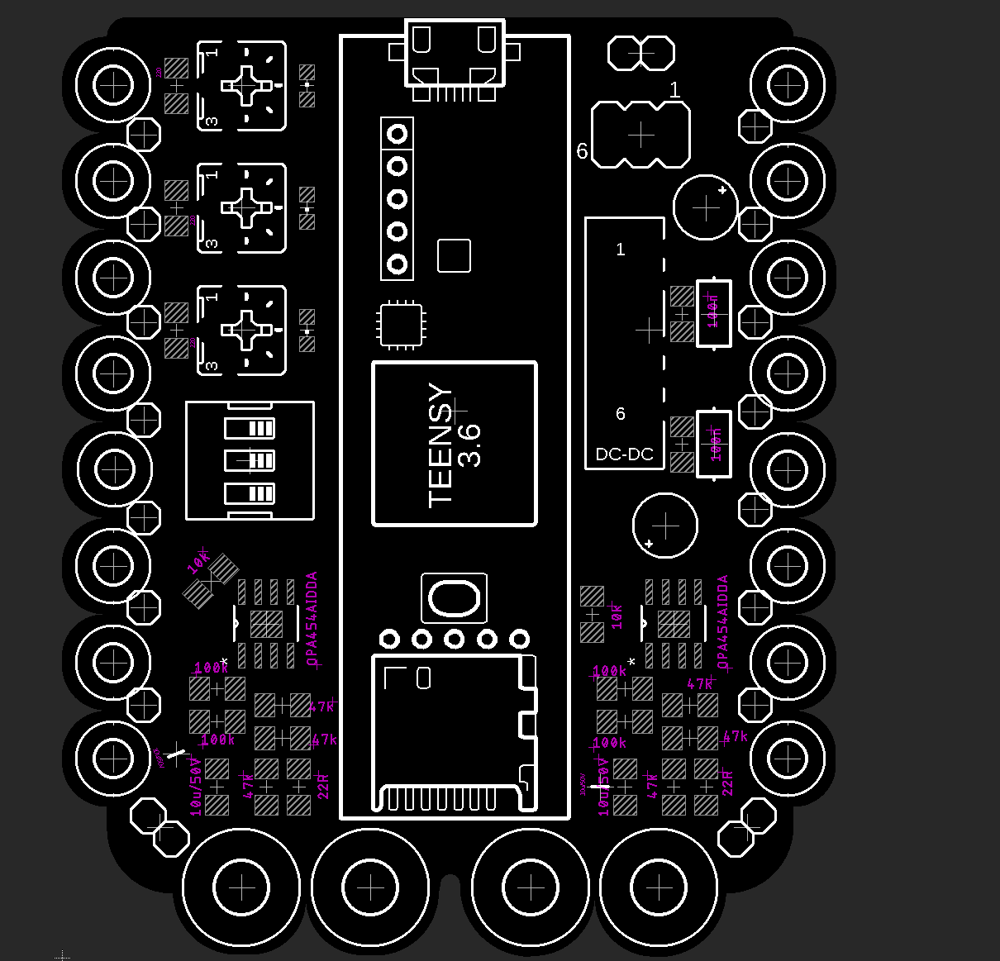

# Temera - EMS eTextile Shield for Teensy

TL;DR - A custom board and code for integrating electronics (especially EMS) into fabric garments.

Temera is a soft, finnles, Sleeper Ray, with paired electric organs. Temera is also a platform for creating soft circuits with paired EMS stimulation outputs.

Specifically, Temera is a prototype two-channel EMS shield, designed to be easily incorporated into fabrics.
16 GPIO that can be set to Analog Input as well as 2 Channels of EMS are broken out. In addition to pins, we added holes, so that each channel can easily be connected to using conductive thread. 

This is an early prototype that is still under active development. More details to follow.

Code:

The driver code is available in this repository as well. The stable implementation provides all of the basic code to get you started. There is also a 'dev_code' version of the code available, where we continue to play with further developments. (We recommend using the stable implementation, at least until you are comfortable with its operation).

Work from the Run_EMS.ino file. This handles the board and the EMS signal generation. The signal generation works through a series of timers handled by the Teensy. There are individual timers per channel frequency and pulse width. Per channel, a frequency timer ticks along at the desired frequency of stimulation. This frequency timer then handles triggering the pulse width timer to run, so that each pulse of EMS is the correct shape / length. 

DEV_Code changes:
+ Basic sensor integration outline - stim if some sensor value between x and y
+ Change potentiometer to work constantly when in manual update mode 

(Worth noting, Teensys are more stable on Windows than on a Mac).
